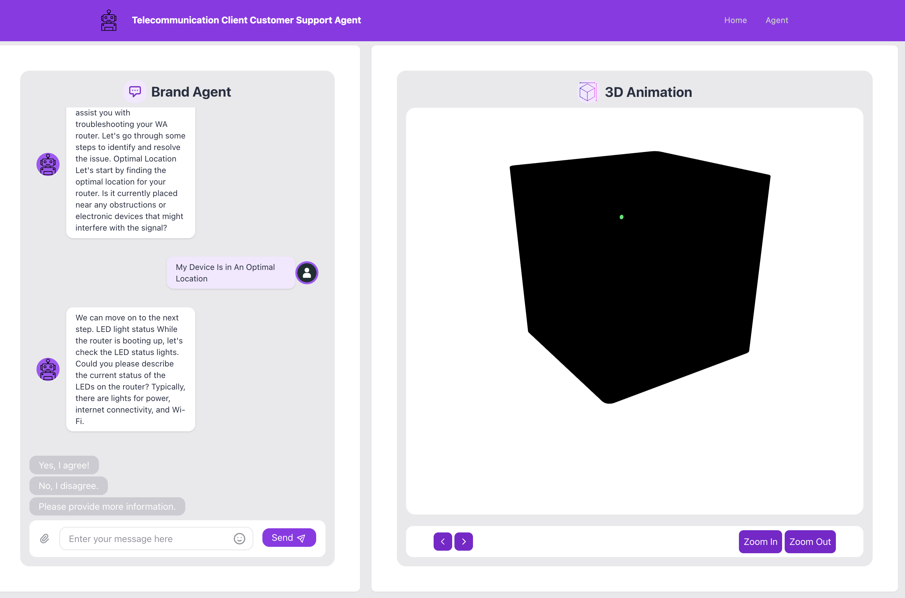
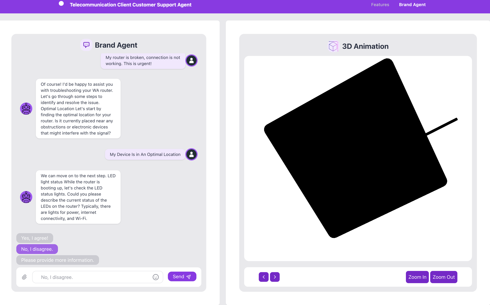
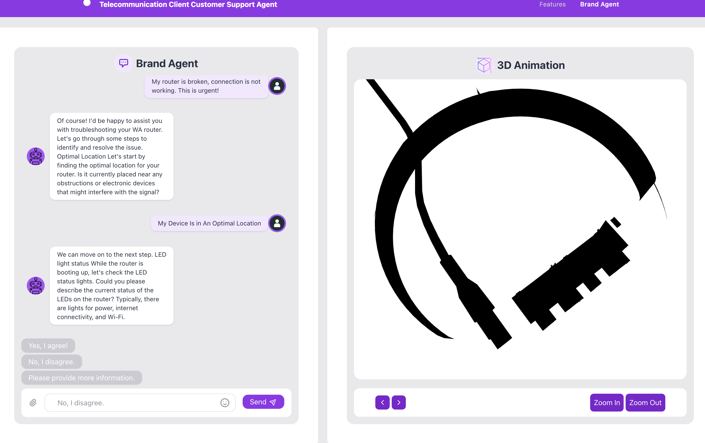
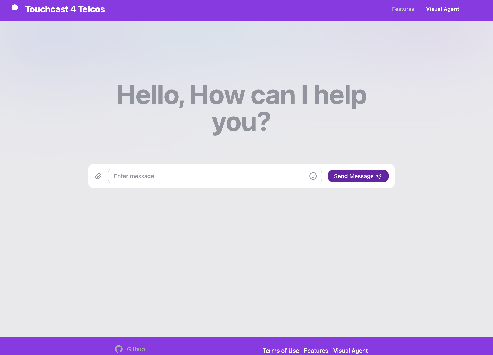

# jostaberry - 👾 3D Graphics Rendering and AI Chat Application 💬 
Project Overview
 
A web application that integrates advanced graphics rendering with AI chat functionalities, and it is set up using Astro, a modern frontend framework. The application leverages the following key components and features:

WebGL Integration: The application has a core WebGL class that sets up Three.js, a popular 3D graphics library. This class, named WebGL, handles rendering, scene, camera, resizing events, and frame animations. Shader programs are also being developed for this purpose, with both vertex and fragment shaders (vertexShader.glsl and fragmentShader.glsl) for various graphical effects.

Astro Framework: The frontend is built using the Astro framework. There are distinct pages (index.astro, agent.astro) and reusable components (e.g., Hero, Layout, Card, Canvas, and Chat). The Astro configuration (astro.config.mjs) has been set up to work with TailwindCSS and includes server-side configurations to proxy API requests.

Chat Functionality: Within the application, there's a chat component, an AI-driven chatbot. It communicates with Azure ML, as seen from the azureML.js module, which handles posting data to an Azure endpoint. This module was refactored to use Axios for HTTP requests and better handle chat histories.

Server-Side Operations: A separate Express server (server.js) has been established, to act as a middleware or proxy server. This server is responsible for making post requests, using Axios, to an external API. The server is set up with CORS for cross-origin requests and includes logging middleware for monitoring incoming request bodies.

Configuration and Build Tools: The project has TypeScript (ts.config.json) for static typing and robust tooling. The build and development processes are managed using npm scripts defined in package.json.

Styling with TailwindCSS: TailwindCSS is integrated into the Astro framework, allowing for utility-first CSS, which makes for rapid UI development.

In essence, the jostaberry project seems to be a rich web application that merges 3D graphics rendering capabilities with interactive chat functionalities, AI-powered, all built on a modern stack comprising Astro, Three.js, TypeScript, and Express.


Getting Started
1. Installation

Clone the repository:

```
git clone https://github.com/mollybeach/jostaberry.git
```

2. Navigate into the project directory:

```
cd jostaberry
cd webapp
```

3. Start the application:

```
npm run start
```










## 🚀 Project Structure

Inside of your Astro project, you'll see the following folders and files:

```
/
├── config/
│   ├── astro.config.mjs
│   ├── config.js
│   ├── pretter.config.cjs
│   ├── tailwind.config.cjs
│   └── tsconfig.json
├── public/
│   ├── images/
│   │   ├── png/
│   │   │   ├── bot.png
│   │   │   └── user.png
│   │   ├── readme/
│   │   │   ├── brand-agent.png
│   │   │   ├── cable-router.png
│   │   │   ├── home-page.png
│   │   │   └── router-green-button.png
│   │   └── svg/
│   │       └── favicon.svg
│   └── models/
│       ├── fbx/
│       │   ├── model_RouterDiff.png
│       │   ├── model_RouterNrm.png
│       │   └── model_RouterOriginal.fbx
│       ├── glb/
│       │   ├── model_BoomBox.glb
│       │   ├── model_CreditCard.glb
│       │   ├── model_DesktopPC.glb
│       │   ├── model_EmojiHeart.glb
│       │   ├── model_FilmClapperBoard.glb
│       │   ├── model_FolderIcon.glb
│       │   ├── model_Laptop.glb
│       │   ├── model_LowPolyPhone.glb
│       │   ├── model_MovieReel.glb
│       │   ├── model_MusicIcons.glb
│       │   ├── model_PhoneCallIcon.glb
│       │   ├── model_PhoneRingIcon.glb
│       │   ├── model_Plane.glb
│       │   ├── model_RemoteControl.glb
│       │   ├── model_RollingBag.glb
│       │   ├── model_SaveToCloud.glb
│       │   ├── model_SecurityCamera.glb
│       │   ├── model_Sports.glb
│       │   ├── model_Television.glb
│       │   ├── model_VideoGameController.glb
│       │   ├── model_VideoGameController2.glb 
│       │   ├── model_WifiExtender.glb
│       │   ├── model_WifiIcon.glb
│       │   ├── model_LogoAccenture.glb
│       │   ├── model_Router90DegreeRotation.glb
│       │   ├── model_RouterCableTexture.glb
│       │   ├── model_RouterLightBlinkTexture.glb
│       │   ├── model_RouterNoTexture.glb
│       │   └── model_RouterResetButtonTexture.glb
│       ├── gltf/
│       │   ├── model_RouterCableTexture.gltf
│       │   ├── model_RouterLightBlinkTexture.gltf
│       │   ├── model_RouterNoTexture.gltf
│       │   └── model_RouterResetButtonTexture.gltf
│       └── mp4/
│           ├── model_PhoneBlack.mp4
│           ├── model_PhoneBlue.mp4
│           ├── model_PhoneColorsAll.mp4
│           ├── model_PhoneColorsMauve.mp4
│           ├── model_PhoneColorsRed.mp4
│           ├── model_PhoneColorsWhite.mp4
│           ├── model_PhoneColorsYellow.mp4
│           ├── model_House.mp4
│           ├── model_House1stHalf.mp4
│           ├── model_House2ndHalf.mp4
│           ├── model_House2nd.mp4
│           ├── model_HouseZoom.mp4
│           ├── model_Upsell1st.mp4
│           ├── model_Upsell2nd.mp4
│           ├── model_Upsell3rd.mp4
│           ├── model_Upsell4th.mp4
│           ├── model_Upsell5th.mp4
│           ├── model_UpsellPhoneColorsMultiStep1st.mp4
│           └── model_UpsellPhoneColorMultistep2nd.mp4
├── src/
│   ├── api/
│   │   └── azureML.js
│   ├── components/
│   │   ├── animations/
│   │   │   ├── Canvas.astro
│   │   │   ├── CanvasBar.astro
│   │   │   └── CanvasScene.astro 
│   │   ├── common/
│   │   │   ├── Box.astro
│   │   │   ├── Card.astro
│   │   │   ├── CardHeader.astro
│   │   │   ├── CardHolder.astro
│   │   │   └── Container.astro
│   │   ├── messages/
│   │   │   ├── Chat.astro
│   │   │   ├── ChatBar.astro
│   │   │   ├── ChatMessages.astro
│   │   │   └── ChatSuggestionBar.astro
│   │   ├── primitives/
│   │   │   ├── Button.astro
│   │   │   ├── Link.astro
│   │   │   └── Svg.astro
│   │   └── templates/
│   │       ├── Footer.astro
│   │       ├── Header.astro
│   │       └── Hero.astro 
│   ├── data/
│   │   ├── assetMap.js
│   │   ├── baseCommand.js
│   │   ├── commandMap.js
│   │   ├── sampleMessageData.js
│   │   └── sampleSuggestionsData.js
│   ├── graphics/ 
│   │   ├── core/
│   │   │   └── WebGL.js
│   │   ├── shader/
│   │   │   ├── fragmentShader.glsl
│   │   │   └── vertexShader.glsl
│   │   ├──utils/
│   │   │       └── OrbitControls.ts
│   │   └── ThreeCanvas.ts
│   ├── layouts/
│   │   └── Layout.astro
│   ├── pages/
│   │   ├── agent.astro
│   │   └── index.astro
│   ├── stores/
│   │   └── store.js    
│   └── styles/
│       ├── classStyles.js 
│       └── svgStyles.js
├── types/
│   └── env.d.ts
│       ├── env.d.ts
│       └── glsl.d.ts
├── .env
├── package.json
└── README.md
```
Astro looks for `.astro` or `.md` files in the `src/pages/` directory. Each page is exposed as a route based on its file name.

There's nothing special about `src/components/`, but that's where we like to put any Astro/React/Vue/Svelte/Preact components.

Any static assets, like images, can be placed in the `public/` directory.

## 🧞 Commands

All commands are run from the root of the project, from a terminal:

| Command                   | Action                                           |
| :------------------------ | :----------------------------------------------- |
| `npm install`             | Installs dependencies                            |
| `npm run dev`             | Starts local dev server at `localhost:3000`      |
| `npm run build`           | Build your production site to `./dist/`          |
| `npm run preview`         | Preview your build locally, before deploying     |
| `npm run astro ...`       | Run CLI commands like `astro add`, `astro check` |
| `npm run astro -- --help` | Get help using the Astro CLI                     |

## 👀 Want to learn more?

Feel free to check [our documentation](https://docs.astro.build) or jump into our [Discord server](https://astro.build/chat).
